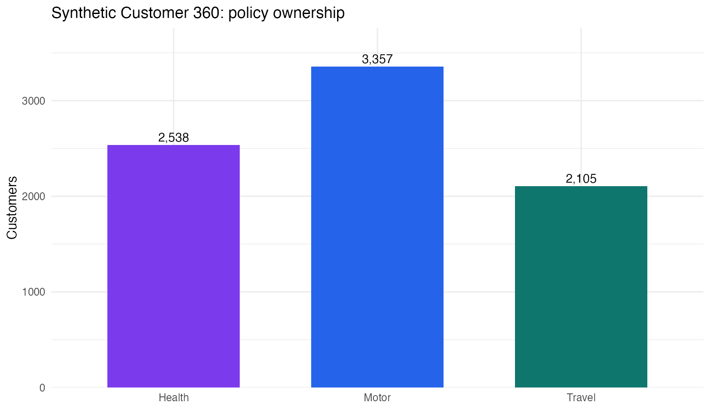
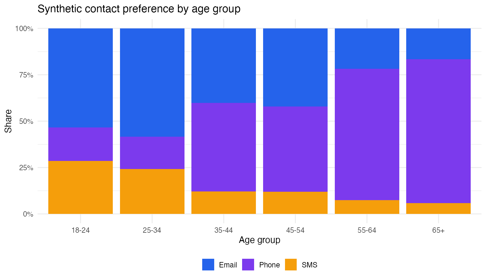

# Insurance Customer 360 — SQL + R

This project joins customer records with motor, health and travel policy tables while preserving customers who do not own every product. The resulting customer-level table supports product-ownership, cross-sell and communication-channel analysis.

The original MSc project analysed **4,085 customer records** across four source tables. For GitHub, I replaced the Microsoft Access-specific queries with portable DuckDB SQL and used a clearly labelled synthetic dataset that preserves the original relational structure.

## Decision outcome

The customer 360 supports three commercial questions:

1. Which customers hold motor, health and travel products?
2. Where are the strongest multi-policy and cross-sell opportunities?
3. Which contact channels fit different age, location and household segments?

The original analysis identified **975 triple-policy customers** and substantial differences in communication preference by age and location. The public demo recreates those structural totals for pipeline validation; it does not reproduce private customer records.



## Data model

```text
customers (one row per customer)
   |-- MotorID  --> motor_policies
   |-- HealthID --> health_policies
   `-- TravelID --> travel_policies
            |
            v
     LEFT JOIN customer_360
```

`LEFT JOIN` is deliberate: a missing product row can mean that a customer does not own that product. It is structural missingness, not automatically a data-quality failure.

## Technical controls

- Primary-key uniqueness checks for every table.
- Foreign-key orphan checks before integration.
- One-row-per-customer assertion after joining.
- Standardised channel, location and gender values.
- Explicit ownership flags and policy-count derivation.
- Synthetic evidence labelled at every output boundary.
- Portable SQL that can run locally or in CI.

## Commercial outputs

| Output | Use |
|---|---|
| Product ownership summary | Portfolio penetration and cross-sell baseline |
| Policy-count distribution | Identify single-, dual- and triple-policy cohorts |
| Channel by age/location | Target contact strategy |
| Family-household ownership | Bundle and advice-led outreach |
| Data-quality audit | Fix upstream controls before scaling analytics |



## Repository guide

| Path | Purpose |
|---|---|
| `sql/01_build_customer_360.sql` | Relational integration and feature creation |
| `sql/02_commercial_insights.sql` | Reusable commercial queries |
| `scripts/generate_demo_data.py` | Synthetic four-table source system |
| `scripts/run_sql.py` | DuckDB execution and validation exports |
| `R/customer_insights.R` | R visualisation and management summaries |
| `tests/` | Row-grain, ownership and output checks |

## Run it

```bash
python -m venv .venv
source .venv/bin/activate
python -m pip install -r requirements.txt
python scripts/generate_demo_data.py
python scripts/run_sql.py
Rscript R/customer_insights.R
python -m unittest discover -s tests -v
```

## Data availability

The source university spreadsheets and Access database are not included because their redistribution status is unclear. All files under `data/demo/`, `outputs/` and `figures/` are synthetic or derived from synthetic inputs. The SQL and R code are the portfolio artefacts.

## Limitations

- The demo preserves structure and selected aggregate counts, not real customer behaviour.
- Product ownership does not prove propensity or campaign response.
- Communication preference should be validated against consent and engagement data before use.
- Spark was evaluated conceptually in the academic report but is unnecessary at this public demo scale.

## Author

**Muhammad Ahmed Shoaib**<br>
SQL, customer analytics, data quality and decision support.
